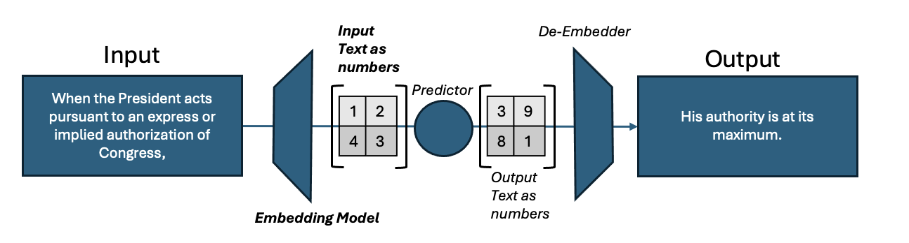
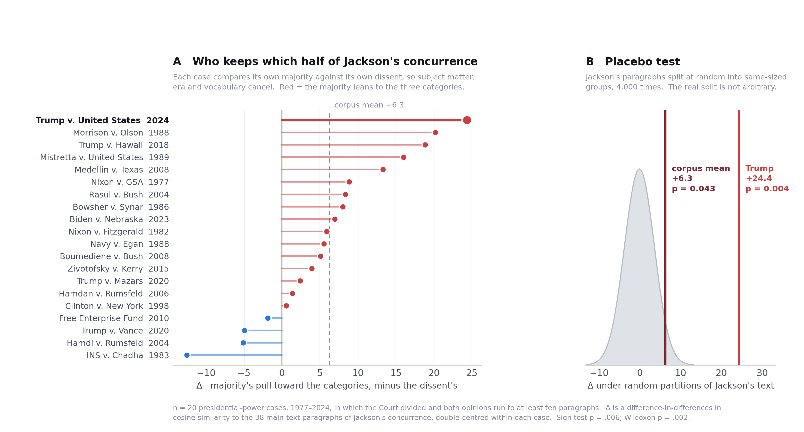

# A Selective Precedent? *Youngstown* and Presidential Immunity

**Darius Sattari**

> Did the majority in *Trump v. United States* (2024) use *Youngstown* differently
> from other Supreme Court decisions — more selectively, taking one part of Justice
> Jackson’s concurrence and leaving the rest? Across twenty divided presidential-power
> cases, majorities lean on Jackson’s three categories and dissents on his structural
> warning. *Trump* is the most extreme instance in the set.

| | |
|---|---|
| Corpus | 27 cases, 97 opinions, ~5,500 substantive paragraphs (1974–2024) |
| Divided cases analysed | 20 |
| Majority leans to the categories | 16 of 20 cases |
| Corpus mean Δ | +6.3 |
| *Trump v. United States* | Δ = +24.4 — rank 20 of 20 |
| Placebo partition (corpus / *Trump*) | p = .043 / p = .0035 |

**Reproduce it** → [`docs/METHOD.md`](docs/METHOD.md) · **How the method was arrived at** →
[`docs/PROVENANCE.md`](docs/PROVENANCE.md) · **Manuscript** → [`paper/`](paper/)

```bash
make setup     # python deps + the 133 MB ONNX embedding model
make result    # prints the headline table
```

---

## Opinions as data

Every data scientist or machine learning engineer’s worst nightmare is a disorganized,
noisy dataset. The adage “*garbage in… garbage out*” captures the frustration of
searching for a clean dataset. Supreme Court opinions largely avoid this problem. With
records dating back to the nation’s founding, written with unusual care, these cases
offer data that is abundant and clean.

## The case

Following his loss to Joe Biden in 2020, President Trump was indicted on charges that
he attempted to overturn the election result. The prosecution led to *Trump v. United
States* (2024), where the majority drew on Justice Jackson’s concurrence in *Youngstown
Sheet & Tube Co. v. Sawyer* (1952), in creating protections against criminal prosecution
for official presidential acts. Jackson described three zones. When the President acts
with Congress’s authorization, his authority is at its maximum. When Congress has
neither authorized nor forbidden the action, he operates in a “zone of twilight.” When
he acts against the expressed or implied will of Congress, his power is at its “lowest
ebb,” and he must rely on a constitutional power that Congress cannot limit. The *Trump*
majority builds its zone of absolute immunity on Jackson’s phrase “conclusive and
preclusive.” Jackson, however, wrote those words inside his third category, warning that
a presidential claim to power “at once so conclusive and preclusive must be scrutinized
with caution” (*Youngstown*, 1952). In *Trump*, the same phrase names the category of
presidential power that receives the strongest protection. While the citation is
accurate, what changed is the work the phrase is asked to do.

## The question

This raises my question: did the majority use *Youngstown* differently from other
Supreme Court decisions? More specifically, was it more selective, taking one part of
Jackson’s concurrence and leaving the rest? Legal scholars took up the question soon
after the ruling (see Gillian E. Metzger, *Disqualification, Immunity, and the
Presidency* (2025)). Their close reading is admirable, but the research is a lengthy
process. The rapid growth of Large Language Models (LLMs) has taught us that words and
arguments are data. A model cannot say what the Constitution means, but it can test
whether a reading of *Trump* is unusual within the case law. My question, then, is this:
why not use the data to answer that narrower question?

## What an embedding model does

At its simplest form, an LLM takes text as input and predicts what comes next. To do
that, it first converts words into numbers, as sketched in *Figure 1*. This project uses
a related tool, an embedding model, which converts a whole paragraph into a list of
numbers that captures what the paragraph is about. Two paragraphs that discuss the same
thing in similar terms end up with similar numbers, so the model can say how alike any
two passages are.



**Figure 1:** The embedding model, with the numerical representation of Justice
Jackson’s words shown in bold.

## The corpus

I divided the thirty-eight paragraphs of Jackson’s concurrence into eight sections:
Preamble, Zone 1, Zone 2, Zone 3, Applying the Zones, Rejecting Article II, Inherent and
Emergency, and Structural Warning. The last of these is Jackson’s closing passage on the
dangers of concentrated executive power, which stands apart from the three zones. The
comparison set is twenty-six later presidential-power decisions, from *United States v.
Nixon* (1974) to *Trump v. United States* (2024), taken from the Caselaw Access Project
and the Court’s own slip opinions rendering ninety-seven separate opinions and about
5,500 substantive paragraphs. Every paragraph of every opinion was scored for how
closely it resembles each paragraph of Jackson’s.

## Why the comparison must be made inside a case

My first approach was simply to ask how far each opinion sat from Jackson’s language,
and it taught me that such a distance mostly measures subject matter. Jackson’s zone
paragraphs are about the President’s relationship with Congress, and his warning is
about concentrated power and free government. A detention case such as *Hamdi* naturally
sounds like a candidate for the warning, and a case about who holds a power, such as
*Medellín*, naturally sounds like it fits the zones. So, the comparison has to be made
inside a case. A majority and a dissent in the same case share the facts, the statute,
the era, and the vocabulary. But what differs is what each side chose to do with
*Youngstown*. For each of the twenty cases in which the Court divided, I asked one
question: relative to its own dissent, how much more does the majority lean on Jackson’s
three zones than on his warning? I call that difference Δ. A positive Δ means the
majority kept the categories and left the warning to the dissent; a negative Δ means the
reverse. Each opinion’s overall resemblance to *Youngstown* is subtracted out first, so
citing it more often does not raise the score. The six cases in which the Court did not
divide, including the unanimous *United States v. Nixon*, are set aside.

## The result

*Figure 2* shows the result. The left panel ranks the twenty cases. Red bars are cases
in which the majority took the zones and left the warning to the dissent; blue bars are
the reverse. Sixteen of the twenty are red, and the dashed line marks the average of
+6.3. A split that lopsided would arise by chance less than one time in a hundred.
*Trump v. United States* sits at the top at +24.4, nearly four times the average and
ahead of *Morrison v. Olson* and *Trump v. Hawaii*. The pattern appears in the security
cases, the separation-of-powers cases, and the cases about the President personally
alike. Referencing the right panel of *Figure 2*, I split Jackson’s paragraphs into two
groups at random, 4,000 times, and recomputed the result each time. The grey curve is
what those random splits produce: a cluster around zero. Only about four random splits
in a hundred reached the real average, and only about four in a thousand reached
*Trump*’s score.



**Figure 2:** Left, the twenty divided cases ranked by Δ. Right, the same statistic under
4,000 random splits of Jackson’s paragraphs, with the real results marked.

## Two cautions

The first of two cautions with these results are that *Trump* is the most extreme case,
but the gap between it and *Morrison* is not wide enough to call it a *different* kind
of case. It just sits at the top of a continuum away from Jackson’s words, not in a
class of its own. Second, the score measures emphasis, not endorsement. It shows which
part of Jackson an opinion works with, not whether the opinion agrees with him. Before
settling on this design, I tried to train the model to predict from an opinion’s text
whether it favored a broader or narrower presidency. It did little better than a coin
flip (which is bad), even though the same method told majorities from dissents with fair
reliability. This is simply a limitation stating that deviation in heavy favor of the
majority does not always mean a broader presidency is argued. It grounds the fact that
*Figure 2* only analyzes differences in the mathematical representation of the text and
ideas that follow.

## What the model adds to the close reading

Trump’s majority took “conclusive and preclusive” from a passage in which Jackson
describes a claim courts should distrust. What the modeling adds is that the surrounding
warning is exactly the material this majority engages least, relative to its dissenters,
of any majority in fifty years of presidential-power cases. Professor Metzger makes the
same point from the legal side, arguing that the *Trump* majority drew on Jackson’s
category of exclusive presidential power while overlooking his warning to scrutinize
such claims with caution, and she points to the opinion’s broad treatment of
presidential control over investigations and prosecutions.

## The answer

The answer to the question I began with is yes. The *Trump* majority used *Youngstown*
more selectively than any other majority in the dataset. It kept Jackson’s classification
scheme and left his warning about concentrated power to the dissent, to a degree no other
case in the set approaches. That is not proof the decision was wrong; the model cannot
judge the law. It is evidence that the majority’s reading of Jackson was unusual by the
Court’s own standards, and that what it left out was the part of the concurrence written
to caution courts about claims of exactly this kind.

This analysis took a week and it’s no substitute for close reading, but it can direct
that reading to the right place. To me, this work shows a real use for the mathematics
behind LLMs, apart from anything they generate, in the legal space.

---

## Behind the essay

The prose above is the paper. Everything that supports it lives in this directory:

| Where | What |
|---|---|
| [`docs/METHOD.md`](docs/METHOD.md) | The formal model — equations (1)–(3), the full statistics table, every robustness check, the null results, the judgment calls, and the known data issues. Start here to reproduce or challenge the result. |
| [`docs/PROVENANCE.md`](docs/PROVENANCE.md) | What was tried in order and why each failure forced the next step. The final design is what survived four earlier ones. |
| [`paper/`](paper/) | The manuscript as submitted, plus the hand-drawn Figure 1. |
| [`src/`](src/) | All code, flat. `within.py` is the headline result; `walkthrough.py` prints every intermediate number and asserts it matches. |
| [`out/`](out/) | Figures (PNG + PDF) and `findings.html`, a standalone write-up of the numbers. |
| [`data/`](data/) | Raw opinions from the Caselaw Access Project and supremecourt.gov. Derived files are git-ignored and rebuilt by `make all`. |
| [`Makefile`](Makefile) | Every step, in order. `make all` runs the pipeline end to end in about four minutes. |

Run every target from this directory — some scripts resolve paths relative to the
working directory.

### Sources and reuse

Opinions come from the Caselaw Access Project (`static.case.law`) and supremecourt.gov,
both public; Supreme Court opinions are federal government works and not subject to
copyright. Embeddings use `BAAI/bge-small-en-v1.5` (Apache-2.0). All inference is by
permutation and bootstrap — no asymptotic standard errors are claimed anywhere.

Code is MIT-licensed, the writing CC BY 4.0. See [the repository root](../README.md#license).
